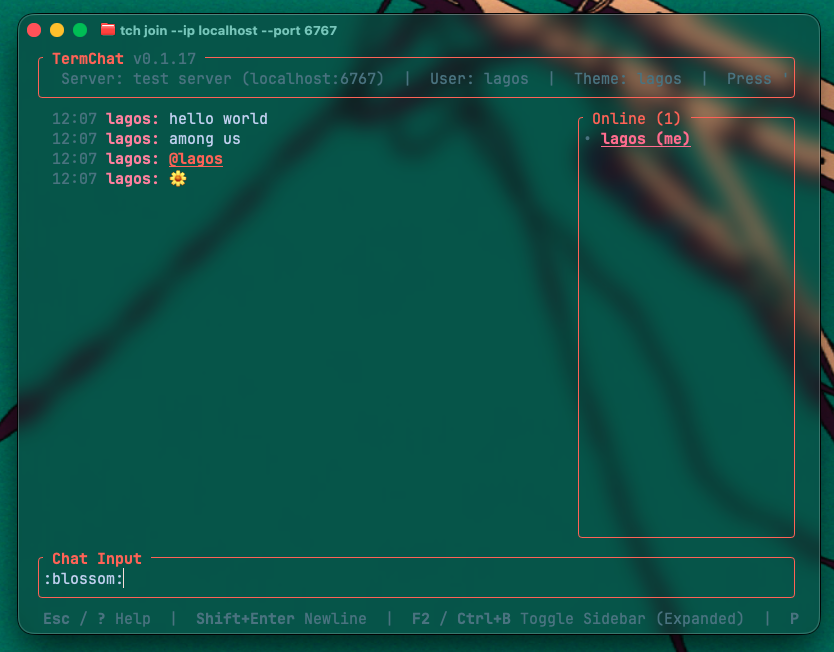
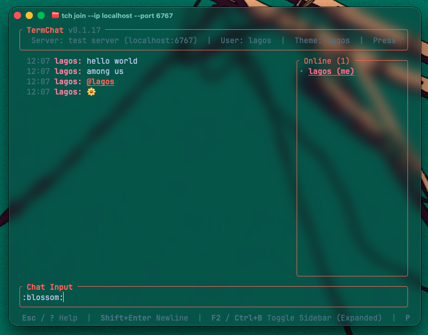

# termchat

A fast, asynchronous, bi-directional chat server and client built entirely for the terminal.




## Features

- **Pure CLI Experience:** No heavy TUI frameworks (too lazy). Native standard I/O with clean padding and ANSI color formatting.
- **Asynchronous Networking:** Powered by `tokio` and `tokio-util` for instant, non-blocking message broadcasting over raw TCP streams.
- **Smart Routing:** The server tracks active connections in real-time, allowing for room rosters and system alerts.
- **Profile Management:** Persists your username locally via config so you don't have to type it on every connection.

## list of features

- [x] server and client connection
- [x] inline chat commands (/theme, /random shi)
- [x] inline chat completions
- [x] theme
- [x] /ask command for chatting with LLMs
- [x] /color to change color of name
- [ ] persistant chat or history
- [ ] better managment with user (auth and config idk)

## Installation

No Rust required — just grab the pre-built binary for your platform.

### Linux & macOS (one-liner)

```bash
curl -sSfL https://raw.githubusercontent.com/LHagfoss/termchat/main/scripts/install.sh | bash
```

This downloads the latest release binary and places it in `~/.local/bin`. Make sure that directory is in your `$PATH` (add `export PATH="$HOME/.local/bin:$PATH"` to your shell config if needed).

### Windows

```powershell
irm https://raw.githubusercontent.com/LHagfoss/termchat/main/scripts/install.ps1 | iex
```
### Arch Linux (AUR)

Coming soon — will publish when im not lazy.

### Homebrew (macOS / Linux)

Coming soon — will publish when im not lazy.

### From source

If you do have Rust installed:

```bash
cargo install --path .
```

---

## Usage

```bash
# Start a server
termchat start

# Join a server
termchat join
```

See `termchat --help` for all commands and options.
