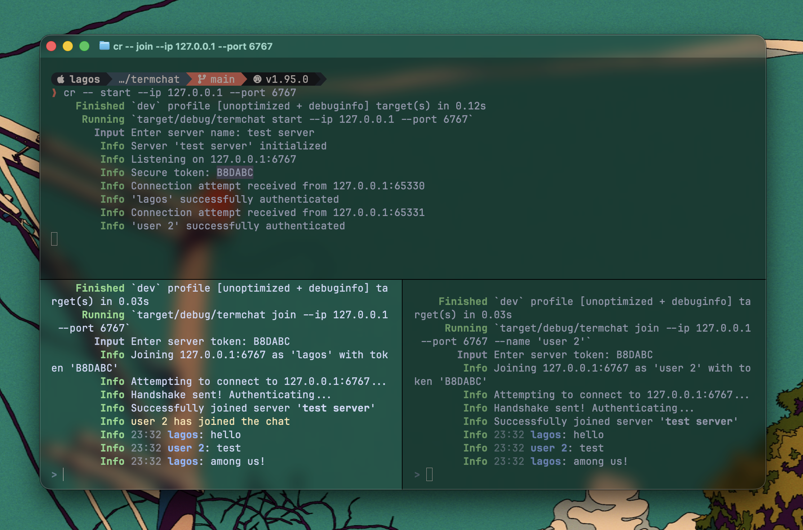

# termchat

A fast, asynchronous, bi-directional chat server and client built entirely for the terminal.

## Features

- **Pure CLI Experience:** No heavy TUI frameworks. Native standard I/O with clean padding and ANSI color formatting.
- **Asynchronous Networking:** Powered by `tokio` and `tokio-util` for instant, non-blocking message broadcasting over raw TCP streams.
- **Smart Routing:** The server tracks active connections in real-time, allowing for room rosters and system alerts.
- **Profile Management:** Persists your username locally via config so you don't have to type it on every connection.
- **Graceful Interruption:** Safely intercepts `Ctrl+C` to close TCP streams cleanly and alert the room before a node disconnects.

## list of features

- [x] server and client connection
- [ ] persistant chat or history
- [ ] inline chat commands (/theme, /random shi)
- [ ] better managment with user (auth and config idk)

## Installation

idk figure it out gng, probably need rust 🦀
